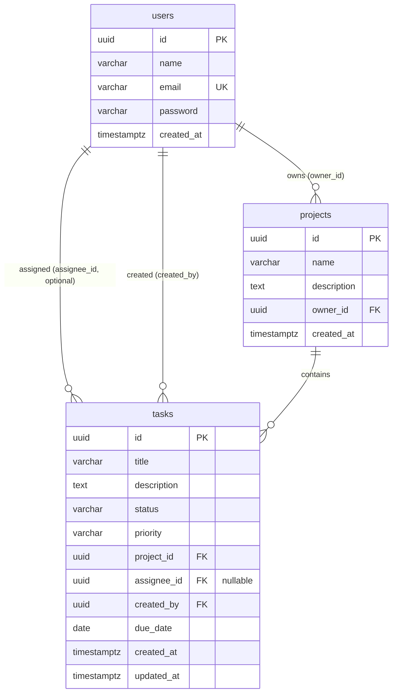

# TaskFlow — Database design

This document describes the PostgreSQL schema defined in `backend/migrations/1775944294000_create-users.sql`, `1775944294001_create-projects.sql`, and `1775944294002_create-tasks.sql`: entities, attributes, indexes, and referential integrity.

---

## Entity–relationship diagram

---

## Tables

### `users`

| Column       | Type           | Constraints                                |
| ------------ | -------------- | ------------------------------------------ |
| `id`         | `UUID`         | `PRIMARY KEY`, default `gen_random_uuid()` |
| `name`       | `VARCHAR(255)` | `NOT NULL`                                 |
| `email`      | `VARCHAR(255)` | `NOT NULL`, `UNIQUE`                       |
| `password`   | `VARCHAR(255)` | `NOT NULL` (bcrypt hash in app)            |
| `created_at` | `TIMESTAMPTZ`  | `NOT NULL`, default `NOW()`                |

---

### `projects`

| Column        | Type           | Constraints                                |
| ------------- | -------------- | ------------------------------------------ |
| `id`          | `UUID`         | `PRIMARY KEY`, default `gen_random_uuid()` |
| `name`        | `VARCHAR(255)` | `NOT NULL`                                 |
| `description` | `TEXT`         | nullable                                   |
| `owner_id`    | `UUID`         | `NOT NULL`, `FK → users(id)`               |
| `created_at`  | `TIMESTAMPTZ`  | `NOT NULL`, default `NOW()`                |

---

### `tasks`

| Column        | Type           | Constraints                                                           |
| ------------- | -------------- | --------------------------------------------------------------------- |
| `id`          | `UUID`         | `PRIMARY KEY`, default `gen_random_uuid()`                            |
| `title`       | `VARCHAR(255)` | `NOT NULL`                                                            |
| `description` | `TEXT`         | nullable                                                              |
| `status`      | `VARCHAR(20)`  | `NOT NULL`, default `'todo'`, `CHECK` ∈ `todo`, `in_progress`, `done` |
| `priority`    | `VARCHAR(20)`  | `NOT NULL`, default `'medium'`, `CHECK` ∈ `low`, `medium`, `high`     |
| `project_id`  | `UUID`         | `NOT NULL`, `FK → projects(id)`                                       |
| `assignee_id` | `UUID`         | nullable, `FK → users(id)`                                            |
| `created_by`  | `UUID`         | `NOT NULL`, `FK → users(id)`                                          |
| `due_date`    | `DATE`         | nullable                                                              |
| `created_at`  | `TIMESTAMPTZ`  | `NOT NULL`, default `NOW()`                                           |
| `updated_at`  | `TIMESTAMPTZ`  | `NOT NULL`, default `NOW()`                                           |

---

## Relationships (foreign keys)

| From         | To           | Column(s)     | Cardinality (logical)             | `ON DELETE`             |
| ------------ | ------------ | ------------- | --------------------------------- | ----------------------- |
| **projects** | **users**    | `owner_id`    | Many projects → one user (owner)  | `CASCADE`               |
| **tasks**    | **projects** | `project_id`  | Many tasks → one project          | `CASCADE`               |
| **tasks**    | **users**    | `assignee_id` | Many tasks → zero or one assignee | `SET NULL`              |
| **tasks**    | **users**    | `created_by`  | Many tasks → one creator          | *(default `NO ACTION`)* |

### Delete behavior (summary)

- Deleting a **user** who **owns** projects: `**projects` rows are removed** (`CASCADE` on `projects.owner_id`), which **cascades to all tasks** in those projects (`tasks.project_id` → `projects`).
- Deleting a **project**: **all its tasks** are removed (`CASCADE` on `tasks.project_id`).
- Deleting a **user** who is only an **assignee**: that user’s `assignee_id` on tasks becomes `**NULL`** (`SET NULL`).
- Deleting a **user** referenced as `**created_by`** on a task: blocked by default `**NO ACTION**` if tasks still reference that user (you must reassign or delete tasks first, or extend the schema with a different rule).

---

## Indexes

| Index                | Table      | Column(s)     | Purpose                       |
| -------------------- | ---------- | ------------- | ----------------------------- |
| `idx_projects_owner` | `projects` | `owner_id`    | List/filter projects by owner |
| `idx_tasks_project`  | `tasks`    | `project_id`  | List tasks in a project       |
| `idx_tasks_assignee` | `tasks`    | `assignee_id` | Filter tasks by assignee      |
| `idx_tasks_status`   | `tasks`    | `status`      | Filter tasks by status        |

Primary keys and unique constraints (`users.email`) are indexed automatically by PostgreSQL.

---

## Migration metadata

Application migrations are tracked in table `**pgmigrations**` (created by `node-pg-migrate`), not shown in the ER diagram above.